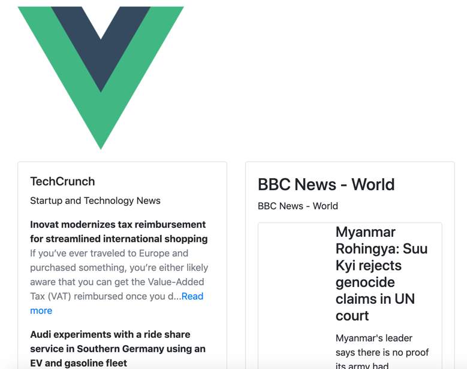

# vue-rss-widget

This unstyled component enables you to display any rssfeed ...anywhere in your app. It uses the RSS2JSON (https://rss2json.com/) service to transform the feed into json format. So, never forget to prefix your feed with https://api.rss2json.com/v1/api.json?rss_url= ...your feed.

While there is a free tier for this service, check other plans on RSS2JSON.

For the sake of simplicity, but also to let it be used with any UI framework, you will have to customize it with VUE SLOT api.

Here under you'll find an example of how to do it.

Check examples here under.



in order to install it in your project
```
npm install vue-rss-widget (or npm i vue-rss-widget)

```

then import the component where you need it

```
<template>
<div>
    <rss-widget>
      
      <template v-slot:feed_header="slotProps">
        <h2>{{slotProps.rssfeed.title}}</h2>
      </template>

      <template v-slot:feed_body="slotProps">
        <ul >
          <li v-for="(item,i) in slotProps.items" :key="i">
            <div class="card">
              <div class="card-header">
                  <h4>{{item.title}}</h4>
              </div>
              <div class="card-body">
                  {{item.description}}
              </div>
            </div>
          </li>
        </ul>
      </template>
    </rss-widget>
    </div>
</template>

<script>
import RssWidget from "vue-rss-widget"

export default {
    components: {
    RssWidget
    },
}

</script>
<style scoped>

</style>

```


## Available props

| Prop                  | Type                        | Required | Default   | Description |
|-----------------------|-----------------------------|----------|-----------|-------------|
| feed                | String |     NO     | the url of the feed      | Provide the full url of the feed|


## Slots

| Name              | Params                       | Info                                                  |
| ----------------- | ---------------------------- | ----------------------------------------------------- |
| **feed_header**         | use the vairable you want to retrieve data (ex.slotProps)         | you'll get rssfeed.title, rssfeed.image, rssfeed.description, rssfeed.url               |
| **feed_body**         | use the vairable you want to retrieve data (ex.slotProps)         | items {title,description,image,author,pubDate,categories[]}              |


## see it on the great great Codesandbox
This example uses bootstrap-vue
[](https://codesandbox.io/s/vue-rss-widget-6x4n2?fontsize=14&hidenavigation=1&theme=dark)

## Version History
- 0.1.0 First Working Version.